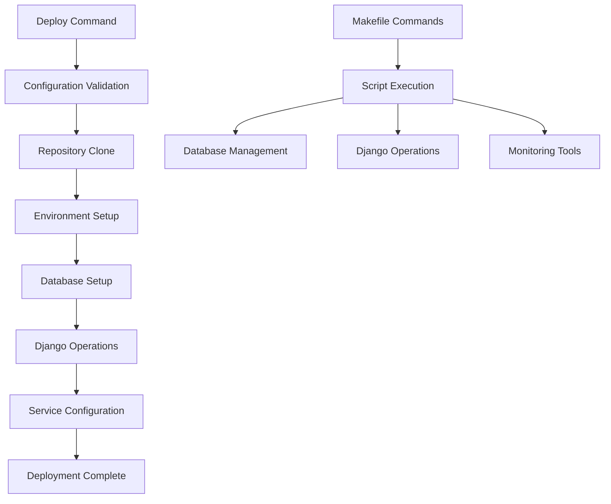

# PyDeployer Documentation

Welcome to PyDeployer, a comprehensive Django deployment automation tool designed for Ubuntu LTS servers. PyDeployer simplifies the deployment process with a modular architecture, robust error handling, and extensive configuration options.

## What is PyDeployer?

PyDeployer is a deployment automation tool that:

- **Automates Django deployments** with a single command
- **Manages branch-based deployments** with automatic isolation
- **Handles database operations** including migrations and user management
- **Provides comprehensive monitoring** and logging capabilities
- **Supports multiple projects** on a single server with isolation
- **Offers flexible configuration** through YAML files

## Key Features

### 🚀 **Simple Deployment**
Deploy any Django project with a single command:
```bash
make deploy REPO_URL=git@github.com:user/project.git BRANCH=main
```

### 🔧 **Comprehensive Management**
- Database setup and migrations
- Static file collection
- Supervisor service management
- Branch-based isolation
- Dependency management

### 📊 **Monitoring & Logs**
- Real-time log viewing
- Deployment status tracking
- Performance monitoring
- Error tracking and alerts

### 🛡️ **Security & Isolation**
- Virtual environment isolation
- Database credential separation
- Multi-branch deployment support
- Secure configuration management

## Quick Start

1. **Install PyDeployer**
   ```bash
   git clone <repository-url>
   cd deployment-tool
   make build
   ```

2. **Deploy Your First Project**
   ```bash
   make deploy REPO_URL=git@github.com:user/sample-app.git BRANCH=main
   ```

3. **Manage Your Deployment**
   ```bash
   # Check status
   make deployment-status PROJECT=sample-app BRANCH=main
   
   # View logs
   make view-logs PROJECT=sample-app BRANCH=main
   
   # Run migrations
   make run-migrations PROJECT_DIR=/srv/deployments/sample-app/main/code
   ```

## Architecture Overview



## Getting Help

- **[Getting Started](getting-started/installation.md)** - Installation and basic setup
- **[User Guide](user-guide/deployment-basics.md)** - Comprehensive usage guide
- **[Examples](examples/sample-app.md)** - Real-world deployment examples
- **[Reference](reference/configuration.md)** - Complete configuration reference

## Support

For issues, questions, or contributions:

- Check the [Troubleshooting Guide](reference/troubleshooting.md)
- Review [Common Examples](examples/sample-app.md)
- Consult the [Script Reference](reference/scripts.md)

---

*PyDeployer - Making Django deployments simple, reliable, and scalable.*
